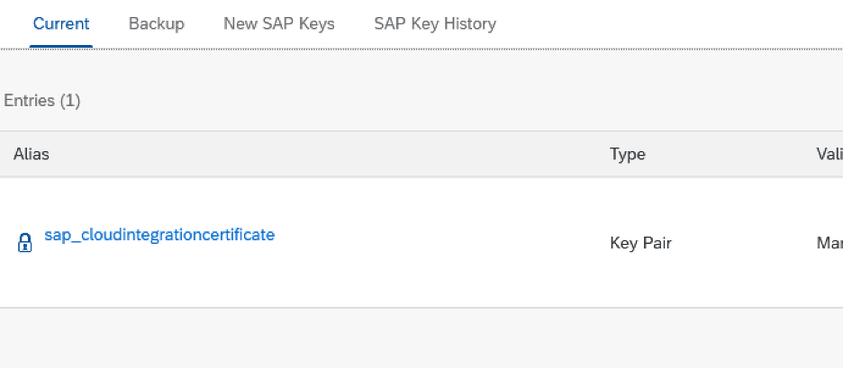

# cpi-partner-directory

The SAP CPI AS2 Sender can be configured to determine the AS2 Partner ID by the selection of the option `PARNTER ID RESOLUTION - Source` which is found under the Processing tab of the AS2 Sender configuration. The available options are: `AS2 Partner ID Header`, `Authoriated User` and `Dynamic`. This scenario utilizes a shared user/credential and determines the Partner ID by the header, so it will rely on the value being set to `AS2 Partner ID Header`.

## Create Partner Directory Service Credential

- In the BTP cockpit choose **Services -> Service Marketplace**
- Choose the service **Process Integration Runtime**
- Choose **Create** and create a service with the following details
  - Plan: **api**
  - Roles: **AuthGroup_TenantPartnerDirectoryConfigurator**
  - Grant-types: **Client Credentials**

## Setup Postman Environment

- Download the files

  - [CPI Tenant Template.postman_environment](<./CPI Tenant Template.postman_environment.json>)
  - [CPI Partner Directory.postman_collection.json](<./CPI Partner Directory.postman_collection.json>)

- Import the files into postman
- Set the **CPI Tenant Template** as the environment and provide the values from the service instance.

## Establish Authentication

- Establish authentication by running the request **Get Token**. This will set the environment variable `cpi_access_token` which is used to authenticate all other requests.

## Creating the Shared account

An authorizated user is still required for this scenario to successfully read the data from the partner directory. To create this, open the request `Create Authorized User`. The user for example in the case of a Client Credential, should be the client id of the credential that is shared with the partners, which has the user role `ESBMessaging.send`. Use the Pid `shared` or similar to denote that it has no relation to any of the partners that will be created.

Example request

```
{
  "Pid": "shared",
  "User": "sb-******-b12345"
}
```

## Creating Partner and Parameters

- A Pid or Partner ID is created by creating a String Parameter. Using the noted request `Create String Parameters` create the following parameters

| Parameter                        | Request                  | Possible values                                         | Description                                                                                                                                                                                        |
| -------------------------------- | ------------------------ | ------------------------------------------------------- | -------------------------------------------------------------------------------------------------------------------------------------------------------------------------------------------------- |
| Pid                              | Create String Parameters |                                                         | The AS2 Partner ID of the customer                                                                                                                                                                 |
| SAP_AS2_Inbound_Decrypt_Message: | Create String Parameters | true, false                                             | does the incoming message require signature verification does the incoming message required decryption                                                                                             |
| AS2_Private_Key_Alias            | Create String Parameters | sap_cloudintegrationcertificate                         |                                                                                                                                                                                                    |
| SAP_AS2_Inbound_Verify_Signature | Create String Parameters | notRequired, trustedCertificate, trustedRootCertificate |
| AS2_Sender_Public_Key            | Create Binary Parameters | certificate base64 string without BEGIN and END         | If parameter SAP_AS2_Inbound_Verify_Signature is set to trustedCertificate or trustedRootCertificate in the Partner Directory, the associated key needs to be uploaded into the Partner Directory. |
| Outbound_ProcessDirect_URL       | Create String Parameters |                                                         | this is the process direct url of the flow that will process the message                                                                                                                           |

Example String request

```
{
    "Pid": "MyPID",
    "Id": "SAP_AS2_Inbound_Decrypt_Message",
    "Value": "true"
}
```

Example Binary request - see below for obtaining the key from [Mendelson Install](#Mendelson-Install)

```
{
    "Pid": "MyPID",
    "Id": "AS2_Sender_Public_Key",
    "ContentType": "crt",
    "Value": "MIIDkDCCAnigAwIBAgIOAO...VNxcW4SwvUHIbSg=="
}
```

To convert a crt file to base64 use

```
openssl x509 -inform der -in key.cer -out key64.cer
```

After creating each parameter using the `Get String Parameters` request with the filter `?$filter=Pid eq 'MyPID'` to verify

## AS2 Sender Config


## Mendelson Install

### Notes for Mac setup

- [Download zip](https://sourceforge.net/projects/mec-as2/files/install_mendelson_opensource_as2_1.1b63.zip/download)
- Unzip file
- Open `mendelson_as2_start.sh` in editor
- Change line `addToClasspath "jetty9/lib"` to `addToClasspath "jetty10/lib"`
- Adjust file permission `chmod 755 mendelson_as2_start.sh`
- Run progam in terminal `./mendelson_as2_start.sh`

### Configuration

- In CPI, choose the menu option Monitor->Integrations->KeyStore, download the certificate of of the Key Pair `sap_cloudintegrationcertificate` by choosing `Download Certificate` found under the `Actions` menu.
  

- Import it into Mendelson within the Sign/Crypt option.
  

- Assign this certificate to the partner’s outbound and inbound cert drop downs
  

- Export one of the Mendelson test key’s certificate as shown
  

- Create a new Partner with the following values:

  - Local station: enabled
  - Name: MyPID
  - AS2 id: MyPID
  - Security tab: Set this key for a local Partner config as shown
    

- Add the URL to the AS2 flow as the `Receipt URL` found under the tab `Send` of the partner. Make sure that you include the port `443` in the URL
  

- Choose `Test Connection` and choose the options to `Import Certificates`
